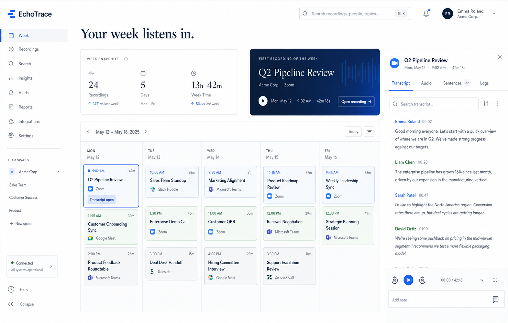

# EchoTrace

EchoTrace is a calendar-first web app for reviewing recorded conversations, transcripts, sentence-level timelines, audio playback, and processing state from PostgreSQL.

It is built for a workflow where recordings are captured externally, processed through automation, written into PostgreSQL, and then curated in a focused weekly UI.



## What it does

- Shows recordings in a weekly calendar view
- Opens a recording detail view with transcript, sentences, audio, logs, and metadata
- Supports review states such as `pending_review`, `approved`, and `rejected`
- Supports pipeline state resets for reprocessing
- Streams audio files from a mounted folder or public URL
- Supports passkey-based login with optional registration lockout

## Stack

- Next.js 15
- React 19
- TypeScript
- Tailwind CSS 4
- Drizzle ORM
- PostgreSQL
- WebAuthn / Passkeys via `@simplewebauthn`

## Local development

1. Install dependencies:

```bash
npm install
```

2. Copy the environment template:

```bash
cp .env.example .env.local
```

3. Update `.env.local` for your setup.

4. Start the app:

```bash
npm run dev
```

The app runs on [http://localhost:3000](http://localhost:3000).

## Environment variables

### Database

- `DATABASE_URL`: PostgreSQL connection string
- `USE_MOCK_DATA`: set to `true` for UI development without live recording data

### Time and audio

- `APP_TIMEZONE`: display timezone, for example `Europe/Berlin`
- `AUDIO_FILES_ROOT`: directory inside the app/container where audio files are available
- `AUDIO_PUBLIC_MODE`: `proxy` or `url`
- `AUDIO_PUBLIC_BASE_URL`: base URL for public audio files when using `url`
- `AUDIO_FILE_NAMING`: `auto`, `filename`, or `transcript_id`

### Passkey authentication

- `AUTH_RP_ID`: relying party ID, usually `localhost` for local development
- `AUTH_RP_NAME`: relying party display name
- `AUTH_ORIGIN`: full app origin, for example `http://localhost:3000`
- `AUTH_SESSION_SECRET`: secret used to sign session cookies
- `AUTH_ALLOW_REGISTRATION`: `true` to allow initial account creation, `false` to disable further registration

### n8n prompt runs

- `N8N_LLM_RUNS_WEBHOOK_ENDPOINT`: base webhook URL for prompt runs, without the prompt ID.

Example:

```env
N8N_LLM_RUNS_WEBHOOK_ENDPOINT=https://n8n.imount.de/webhook/c0d1e9c7-c25a-4826-8d0e-5cb6d967812d/llm-run
```

When you select prompt `963e718a-9601-4747-a1c6-764ad5b3123d`, EchoTrace posts the Markdown file to:

```text
https://n8n.imount.de/webhook/c0d1e9c7-c25a-4826-8d0e-5cb6d967812d/llm-run/963e718a-9601-4747-a1c6-764ad5b3123d
```

## Audio mounting

If your MP3 files are stored in a flat directory, you can mount them into the app container and stream them through `/api/audio/:recordingId`.

Example:

```env
LOCAL_AUDIO_FILES_PATH=/absolute/path/to/mp3-folder
AUDIO_FILES_ROOT=/data/knowledge/audio
AUDIO_PUBLIC_MODE=proxy
AUDIO_FILE_NAMING=transcript_id
```

With `AUDIO_FILE_NAMING=auto`, the app tries these fallbacks in order:

1. `assembly_ai_transcript_id.mp3`
2. `filename`
3. `recording.id + ".mp3"`

## Passkey setup

To enable passkey login:

1. Run the SQL in [docs/create_passkey_auth.sql](docs/create_passkey_auth.sql)
2. Configure the auth variables in `.env.local`
3. Start the app and open `/login`
4. Register the first account while `AUTH_ALLOW_REGISTRATION=true`
5. Set `AUTH_ALLOW_REGISTRATION=false` and restart the app

That leaves login enabled while preventing further self-registration.

## Database setup

The app expects the main recording tables plus the additional auth tables.

Included SQL helpers:

- [docs/create_passkey_auth.sql](docs/create_passkey_auth.sql)
- [docs/create_recording_logs.sql](docs/create_recording_logs.sql)
- [docs/alter_transcription_processing_status.sql](docs/alter_transcription_processing_status.sql)

## Current feature set

- Weekly calendar navigation
- Dynamic weekday/weekend rendering
- Recording detail modal
- Inline title editing
- Transcript export
- Audio playback with sentence sync
- Review state management
- Pipeline status inspection and reset
- Recording logs
- Passkey login

## Docker

The repository includes a local Docker setup:

```bash
docker compose -f docker-compose.local.yml build --no-cache
docker compose -f docker-compose.local.yml up
```

## Notes

- Passkey login requires a real database because users and credentials are persisted there.
- If you use Safari or another browser with aggressive caching, rebuild the container after frontend changes when verifying UI updates.
